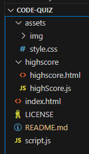
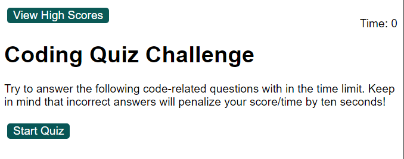

# Code Quiz

## Introduction
Welcome to Code Quiz – a fun and challenging way to test your basic knowledge of front-end development! This quiz is designed for aspiring and experienced front-end developers to assess their proficiency in HTML, JavaScript, and CSS. Whether you're looking to brush up on your skills or prove your expertise, Code Quiz is the perfect tool for you.

## Getting Started
1. Clone the repository:
   ```bash
   git clone https://github.com/embleem/code-quiz.git
2. Open "index.html" in your browser
3. Start playing / editing!



## Usage
1. Or go to the website where it is deployed at: https://embleem.github.io/code-quiz/



## How to Play
1. **Setup**: Clone/download the Code Quiz repository to your local machine OR follow the link to the deployed website.
2. **Open Index.html**: Launch the quiz by opening the `index.html` file in your preferred web browser if going from the cloned repository.
3. **Answer Questions**: The quiz consists of a series of multiple-choice questions. Read each question carefully and select the most appropriate answer.
4. **Score Tracking**: Your score will be calculated in real-time as you answer questions. The quicker you answer, the higher your score!
5. **Completion**: After answering all the questions, you'll receive your final score along with feedback on correct and incorrect answers.

## Features
- **Timer**: A countdown timer adds an element of urgency, challenging you to think on your feet.
- **Interactive Interface**: The quiz boasts a user-friendly interface that enhances the overall experience.
- **Responsive Design**: Code Quiz is optimized for various screen sizes, ensuring a seamless experience on both desktop and mobile devices.

## Technologies Used
- **HTML**: The structure and layout of the quiz.
- **CSS**: Styling elements for an appealing and user-friendly design.
- **JavaScript**: The logic behind the quiz, including question generation, scoring, and timer functionality.


## Resources 
1. **MDN Web Docs (Mozilla Developer Network)**
   - [HTML Basics](https://developer.mozilla.org/en-US/docs/Learn/Getting_started_with_the_web/HTML_basics)
   - [CSS Basics](https://developer.mozilla.org/en-US/docs/Learn/Getting_started_with_the_web/CSS_basics)
   - [JavaScript Basics](https://developer.mozilla.org/en-US/docs/Learn/Getting_started_with_the_web/JavaScript_basics)

2. **W3Schools**
   - [HTML Quiz Tutorial](https://www.w3schools.com/quiztest/quiztest.asp?qtest=HTML)
   - [CSS Quiz Tutorial](https://www.w3schools.com/quiztest/quiztest.asp?qtest=CSS)
   - [JavaScript Quiz Tutorial](https://www.w3schools.com/quiztest/quiztest.asp?qtest=JavaScript)

3. **Codecademy**
   - [Interactive Web Development Courses](https://www.codecademy.com/learn/paths/web-development)

4. **JavaScript Timer Functions**
   - [Countdown Timer in JavaScript](https://www.sitepoint.com/build-javascript-countdown-timer-no-dependencies/)

5. **Git and GitHub Documentation**
   - [GitHub Flow Guide](https://guides.github.com/introduction/flow/)
   - [Git Basics](https://git-scm.com/book/en/v2/Getting-Started-Git-Basics)

## License
MIT License

## Acknowledgements
With help from:
Rockey Willemse